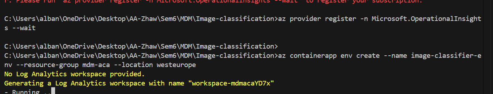
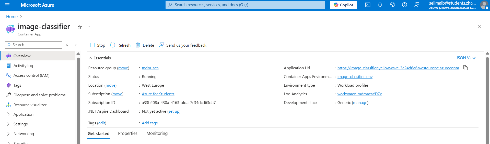
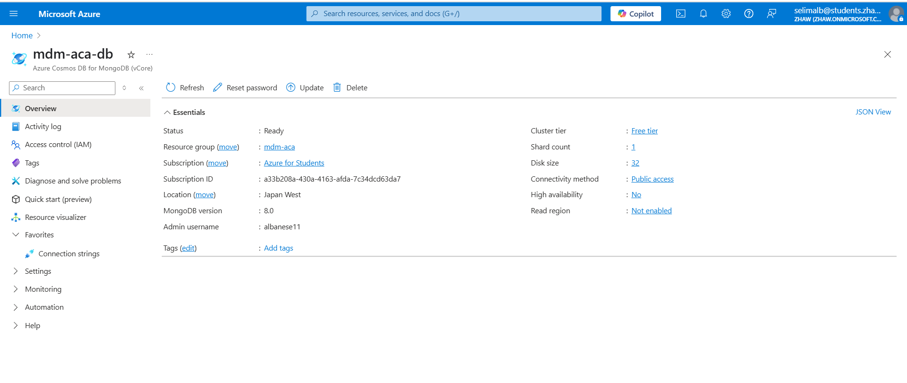
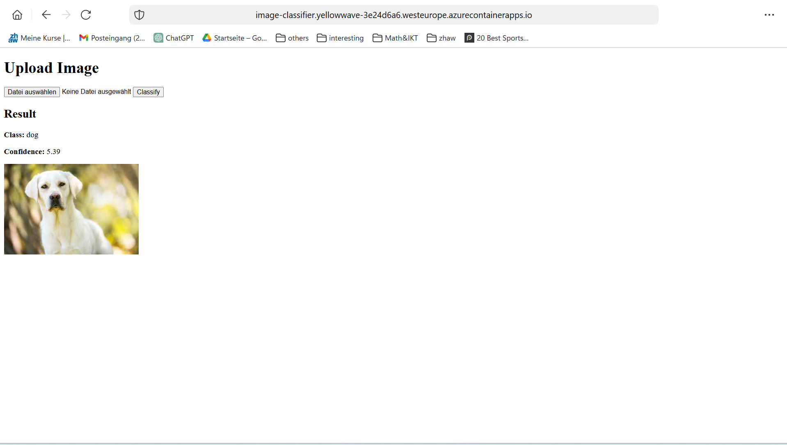
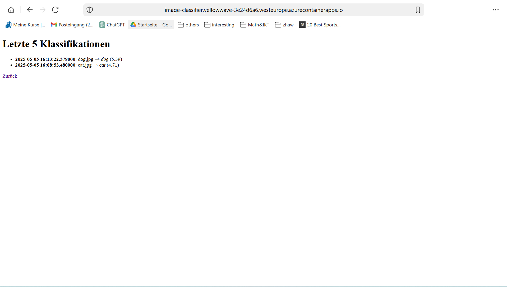

# Lernjournal 2: Web-App zur Bildklassifikation mit KI (ONNX)

## Projektziel
Ziel war die Entwicklung einer KI-basierten Web-App, die es Nutzer:innen erlaubt, ein Bild hochzuladen und eine Bildklassifikation durchzuführen. Die Analyse erfolgt serverseitig mittels eines ONNX-Modells in einer Flask-Anwendung. Zusätzlich werden die Klassifikationsergebnisse in einer Cloud-Datenbank (Azure Cosmos DB, MongoDB vCore) gespeichert und sind über eine Logseite abrufbar.

## Verwendete Technologien
- **Backend**: Python, Flask
- **Modellinferenz**: ONNX Runtime
- **Frontend**: HTML, JavaScript (inline)
- **Containerisierung**: Docker, Docker Compose
- **Deployment**: Azure Container Apps (ACA)
- **Cloud-Datenbank**: Azure Cosmos DB für MongoDB (vCore)
- **Dependency Management**: `requirements.txt`

## Repository
**URL**: [https://github.com/albanesi/image-classifier-onnx](https://github.com/albanesi/image-classifier-onnx) *(optional)*

## Projektstruktur (Auszug)
```
image-classification/
├── app.py
├── model.onnx
├── labels_map.txt
├── requirements.txt
├── Dockerfile
├── docker-compose.yml
├── web/
│   ├── index.html
│   └── logs.html
└── nginx.conf (optional)
```

## Funktionsweise
1. Nutzer:in lädt ein Bild hoch
2. Flask verarbeitet das Bild und übergibt es an das ONNX-Modell
3. Die Vorhersage wird als Label + Confidence angezeigt
4. Ergebnis wird in Azure Cosmos DB gespeichert
5. Eine Logseite zeigt die letzten 5 Klassifikationen

## Lokale Tests
Die App wurde lokal mittels Docker Compose getestet:
```bash
docker-compose up --build
```
Aufruf unter: [http://localhost:5000](http://localhost:5000)

## Beispielcode: Klassifikation + Logging
```python
outputs = session.run(None, {session.get_inputs()[0].name: img})
probs = outputs[0][0]
idx = int(np.argmax(probs))
prediction = labels[idx]
collection.insert_one({
  "filename": filename,
  "prediction": prediction,
  "confidence": float(probs[idx]),
  "timestamp": datetime.utcnow()
})
```

## Deployment auf Azure

### Azure CLI Befehle


```bash
# Docker Image builden und pushen
docker build -t albanese11/image-classifier:latest .
docker push albanese11/image-classifier:latest

# Container App Umgebung erstellen
az containerapp env create   --name image-classifier-env   --resource-group mdm-aca   --location westeurope

# Container App bereitstellen
az containerapp create   --name image-classifier   --resource-group mdm-aca   --environment image-classifier-env   --image albanese11/image-classifier:latest   --target-port 5000   --ingress external
```
**Live-App URL:**  
https://image-classifier.<zufall>.westeurope.azurecontainerapps.io

## Screenshots

### Container App Übersicht


### Cosmos DB (MongoDB vCore)


### App im Einsatz (Index)


### Logs der letzten Klassifikationen


## Reflexion
- Ich konnte ein echtes Machine-Learning-Modell erfolgreich containerisieren und online bereitstellen
- Die Kombination aus ACA und Cosmos DB war eine praxisnahe, produktionsähnliche Erfahrung
- Besonders wertvoll war die Erweiterung um Logging + Loganzeige – dadurch wurde der zweite Container funktional gerechtfertigt
- Beim nächsten Mal würde ich evtl. ein Frontend-Framework nutzen, um die Benutzererfahrung weiter zu verbessern
